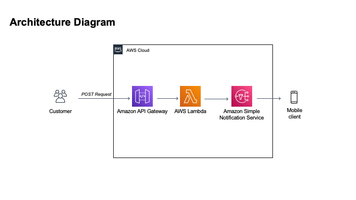

# Serverless Notification Service

A simple, serverless app that sends SMS to subscribers using API Gateway, AWS Lambda and AWS SNS. This is built using Terraform.

### Use Case:

A customer application that sends messages to their clients. Messages can be any of the following:

- Promotional Message
- Alerts (i.e. Restaurant reservations or doctor appointments)
- Reminders

POST Request can be revised for any of the messaging purposes above.



### To deploy:

1. Make sure you have Terraform (>0.13) and aws (>3.0) installed.
2. Set your AWS Profile. **Note:** region variable in the variables file will override your profile region.
3. Create ```terraform.tfvars``` file to assign the variables listed in the variables.tf file.
4. run ```terraform init --var-file terraform.tfvars``` to deploy.

### Future Works:

- Twilio integration 
- API Gateway Auth options (Lambda Authorizer or Auth0)